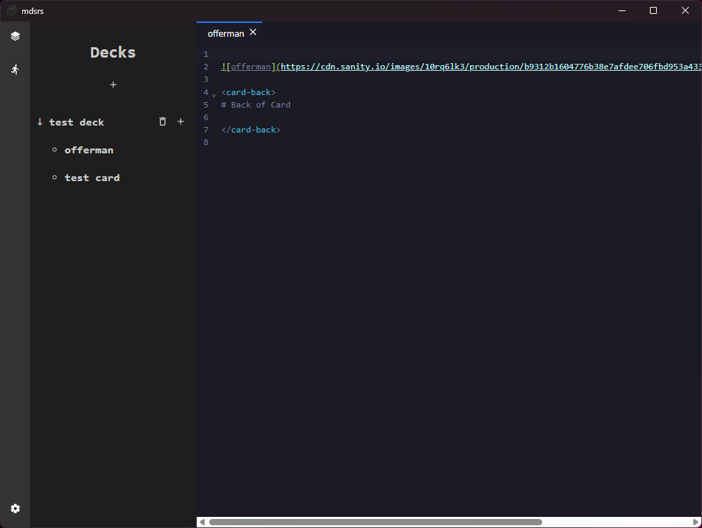
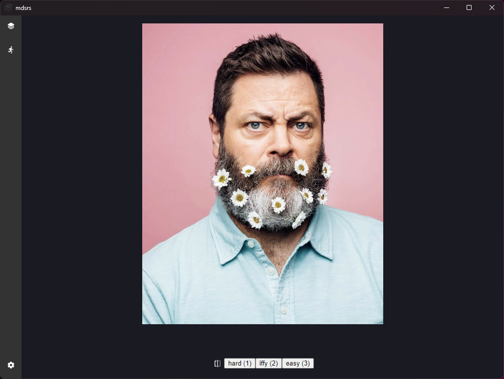
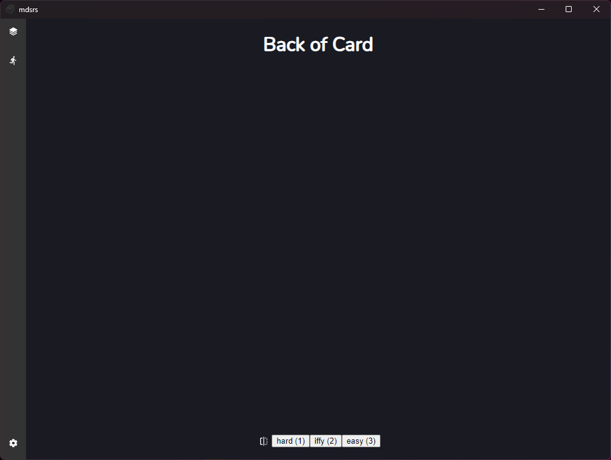

# mdsrs

This is a flash card app that let's you build flash card decks with markdown.


Anything inside the `card-back` tag will be shown on the back of the flash card.

## Example Card

```markdown

# Front of card

<card-back>

# Back of card

</card-back>
```






### Dev

This app is built with [https://wails.io/](https://wails.io/).
To run it, you will need to download their binary [wails](https://wails.io/docs/gettingstarted/installation).
